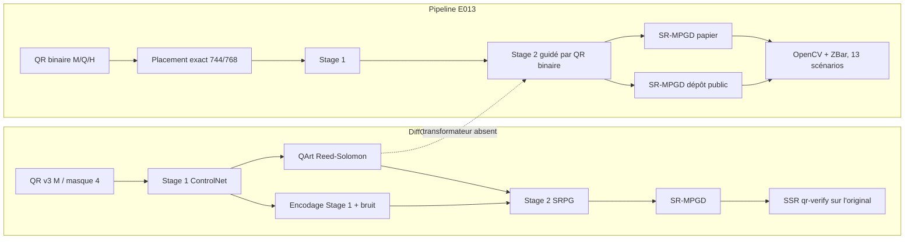

# Audit E013 et état réel du projet Prooftag QR

Date de l'audit : 23 juillet 2026

Sources principales :

- archive `20260723T081024Z-e013-exact-geometry-sd15-sd21-policy-v1.tar.gz` ;
- [article DiffQRCoder, version 3](https://arxiv.org/abs/2409.06355) ;
- dépôt DiffQRCoder figé au commit `e24ea73ee2e13c7e6e87cb422e8b11784e70ae00` ;
- [journal des expériences E000 à E013](experiment-log.md) ;
- [protocole E012](e012-faithful-srmpgd.md) ;
- [protocole E013](e013-exact-geometry-sd21-policy.md).

## Conclusion exécutive

Le projet n'a pas reproduit le taux de 99 % publié par DiffQRCoder. Il a reproduit une partie
importante de la méthode publique, mais pas l'ensemble de la méthode décrite dans l'article.
L'étape QArt qui adapte légalement la matrice QR à l'image Stage 1 tout en préservant le message et
les codes Reed-Solomon manque toujours.

Le chiffre de 99 % de l'article et notre résultat de 1/116 ne mesurent pas la même chose :

- l'article compte la proportion d'images originales lisibles par `qr-verify` sur 100 prompts ;
- E013 exige, pour chaque image, 26 succès simultanés : 13 scénarios multipliés par OpenCV et
  ZBar ;
- une image lisible par un téléphone peut donc échouer à notre porte, et inversement le résultat
  de l'article ne garantit pas 26/26.

E013 contient en plus une erreur de protocole importante : seuls 5 des 12 QR témoins géométriques
au masque 4 passent 26/26. Parmi les 116 résultats, 47 utilisent exactement une combinaison
masque 4 dont le témoin parfait échoue lui-même à la porte. Trente autres recherches utilisent un
masque différent sans témoin correspondant dans l'archive : leur éligibilité n'a pas été prouvée.

Le meilleur résultat réel de l'archive est :

| Élément | Valeur |
|---|---:|
| Méthode | DiffQRCoder SD 1.5 + SR-MPGD du dépôt public |
| Prompt | `p1_simple` |
| Canvas / module | 768 px / 20 px |
| Stage 1 / Stage 2 | 40 / 40 pas |
| ControlNet / SRG / PG | 1,35 / 500 / 3 |
| QR | version 3, correction H, masque 4 |
| Lecture robuste | 26/26 |
| Lecture originale | 2/2 |
| CLIP-aesthetic | 5,408 |
| CLIP brut texte-image | 0,238 |
| Temps | 159,25 s |

Ce succès est isolé. Les trois autres prompts n'ont produit aucun 26/26 et aucune image lisible
par les deux décodeurs sur l'original.

La conclusion honnête est donc :

> DiffQRCoder SD 1.5 reste la seule base sérieuse du projet, mais la pipeline actuelle n'est ni une
> reproduction complète de l'article, ni un générateur Prooftag à 99 %. Elle est encore une
> plateforme expérimentale capable d'un succès strict occasionnel sur un prompt simple.

## 1. Les trois définitions de la scannabilité

### 1.1 SSR publié par DiffQRCoder

Le protocole principal de l'article utilise :

- 100 prompts produits par GPT-4 ;
- Stable Diffusion 1.5 Cetus-Mix Whalefall ;
- QR Monster v2, poids ControlNet 1,35 ;
- 40 pas Stage 1 puis 40 pas Stage 2 ;
- QR version 3, correction M, masque 4 ;
- modules de 20 x 20 px, padding de 80 px ;
- message principal `Thanks reviewer!` ;
- `easynegative` comme prompt négatif ;
- `qr-verify`, fondé sur le décodeur WeChat, pour décider si l'image originale est lisible.

Dans ce protocole, 99 images lisibles sur 100 donnent 99 % de SSR. L'article mesure séparément la
robustesse aux angles et aux appareils. Il rapporte notamment 100 % avec `qr-verify`, 97 % avec un
iPhone 13 et 88 % avec un Pixel 7 sur son sous-ensemble de test. Le décodeur change donc fortement
le résultat, même dans l'article.

L'article reconnaît lui-même dans sa section de limites que la méthode ne garantit pas toujours
100 % et qu'elle exige des ajustements d'hyperparamètres.

### 1.2 Lecture originale E013

`original_passed=2/2` signifie que l'image non dégradée restitue exactement le payload avec :

- OpenCV ;
- ZBar.

C'est la mesure E013 la plus proche du SSR principal de l'article, mais elle utilise encore
d'autres décodeurs que `qr-verify`.

### 1.3 Porte Prooftag E013

`strict_all=true` exige 26/26 :

- original ;
- JPEG 90 et JPEG 70 ;
- flou ;
- luminosité basse et haute ;
- contraste réduit ;
- réduction à 75 % ;
- bruit gaussien ;
- légère perspective ;
- gain et perte de point d'impression ;
- rotation de 3 degrés ;
- chaque scénario avec OpenCV et ZBar.

Cette porte est une qualification de livraison, pas le SSR de l'article.

Même si chaque test individuel réussissait avec une probabilité de 99 % et si les tests étaient
indépendants, la probabilité de réussir les 26 serait :

```text
0,99 ^ 26 = 77,0 %
```

Pour obtenir 99 % de réussite sur la porte complète, il faudrait environ 99,961 % par test
individuel sous cette même hypothèse d'indépendance.

## 2. Différence entre la méthode de l'article et E013



| Dimension | Article | E013 |
|---|---|---|
| Fondation principale | Cetus-Mix / SD 1.5 | même branche SD 1.5, plus une branche SD 2.1 |
| ControlNet principal | QR Monster v2 | même modèle pour SD 1.5 |
| Stage 1 / Stage 2 | 40 / 40 | 40 / 40, plus 100 et recherche 30 à 140 |
| Cible Stage 2 | QArt dérivé du Stage 1 | QR binaire original |
| Correction QR principale | M | H dans les baselines, M/Q/H en recherche |
| Message principal | `Thanks reviewer!` | `https://ptag.io/t/e013` |
| Canvas | coeur 580 px + padding 80 | 744 ou 768, padding exact 82 ou 94 |
| Décodeur SSR | `qr-verify` / WeChat | OpenCV et ZBar |
| Critère principal | image originale lisible | 26 validations simultanées |
| Prompts | 100 | 4 |
| GPU | RTX 4090 | RTX 4000 Ada 20 Go |

La branche SD 1.5 E013 utilise bien les checkpoints et les poids principaux de l'article. Elle
n'est cependant pas une reproduction complète tant que QArt manque.

## 3. Audit de complétude de l'archive E013

Le rapport automatique de l'archive annonce 116 résultats. Ce nombre est exact, mais la campagne
n'est pas complète par rapport au protocole prévu.

| Partie | Prévu | Présent |
|---|---:|---:|
| Baselines | 80 lignes | 80 |
| Recherche SD 1.5 | 32 essais | 32 |
| Recherche SD 2.1 | 32 essais | 4 |
| Total recherche | 64 essais | 36 |
| Confirmation multi-prompt | oui | absente |
| Importance de paramètres | oui | absente de l'archive |
| Modèle CatBoost | sous conditions | non entraîné |

La confirmation coûteuse a été désactivée. L'archive ne prouve donc pas qu'une recette découverte
se généralise aux quatre prompts.

Le sélecteur CatBoost n'a pas été entraîné :

```text
116 lignes
1 positif strict
minimum configuré : 12 positifs
```

Même 12 positifs auraient été très faibles pour 28 paramètres et plusieurs familles de prompts.
Avec un seul positif, un modèle apprendrait surtout à reconnaître le prompt simple et les
conditions de cet essai. Il ne pourrait pas apprendre une recette magique.

## 4. Résultats E013 recalculés

### 4.1 Vue globale

| Mesure | Résultat |
|---|---:|
| Sorties | 116 |
| 26/26 | 1, soit 0,86 % |
| Original 2/2 | 4, soit 3,45 % |
| Moyenne des 26 validations | 7,82 % |
| Médiane des 26 validations | 0 % |
| Pic VRAM | 18,14 Gio |
| Temps moyen | 169,96 s |

Ces 116 lignes ne sont pas 116 tentatives indépendantes. Plusieurs lignes sont des variantes
`base`, `paper_srmpgd` et `upstream_srmpgd` issues d'une même génération. Le calcul automatique
qui transforme 1/116 en un budget de 798 tentatives pour atteindre 99,9 % ne doit pas être utilisé
comme prévision de production.

### 4.2 Par phase et par modèle

| Phase / modèle | N | 26/26 | Original 2/2 | Validation moyenne | CLIP-aes. | CLIP brut | Temps |
|---|---:|---:|---:|---:|---:|---:|---:|
| Baseline SD 1.5 DiffQRCoder | 48 | 1 | 4 | 16,03 % | 4,444 | 0,210 | 206,4 s |
| Baseline SD 2.1 Dion | 32 | 0 | 0 | 0,84 % | 5,593 | 0,296 | 76,8 s |
| Recherche SD 1.5 | 32 | 0 | 0 | 3,37 % | 4,163 | 0,231 | 215,8 s |
| Recherche SD 2.1 | 4 | 0 | 0 | 0,96 % | 5,980 | 0,315 | 111,4 s |

SD 2.1 produit des images mieux notées esthétiquement, mais presque totalement illisibles. Ce
n'est pas une version améliorée de DiffQRCoder : le ControlNet, la pipeline et le guidage ne sont
pas les mêmes. Le portage SRPG complet vers SD 2.1 n'a pas été réalisé.

Le champ E013 `clip_score` est le score brut multiplié par 2,5. Pour comparer à la valeur 0,2992
de l'article, il faut utiliser `clip_similarity`, nommé `CLIP brut` dans ce rapport.

### 4.3 Effet du prompt

| Prompt | N | 26/26 | Original 2/2 | Moyenne | Meilleur |
|---|---:|---:|---:|---:|---:|
| simple | 29 | 1 | 4 | 23,1 % | 26/26 |
| moyen | 29 | 0 | 0 | 2,4 % | 13/26 |
| détaillé | 29 | 0 | 0 | 2,7 % | 3/26 |
| complexe | 29 | 0 | 0 | 3,2 % | 9/26 |

Le seul succès appartient au prompt simple. La probabilité groupée de 0,86 % masque donc le fait
que trois familles sur quatre ont un taux strict observé de zéro.

### 4.4 OpenCV contre ZBar

Sur les 3 016 validations associées aux 116 sorties :

| Décodeur | Succès | Total | Taux |
|---|---:|---:|---:|
| OpenCV | 63 | 1 508 | 4,18 % |
| ZBar | 173 | 1 508 | 11,47 % |

Le choix du décodeur change presque d'un facteur trois le résultat. Cela confirme que le score de
l'article, la lecture téléphone et notre porte logicielle ne sont pas interchangeables.

### 4.5 Scénarios les plus révélateurs

| Scénario | Taux observé |
|---|---:|
| bruit gaussien | 3,02 % |
| rotation 3 degrés | 5,60 % |
| réduction 75 % | 6,03 % |
| original | 6,90 % |
| gain de point d'impression | 17,24 % |
| perte de point d'impression | 12,50 % |

Le gain de point réussit plus souvent que l'original. Cela suggère que beaucoup d'images ont un
signal QR trop clair ou trop texturé : les assombrir artificiellement aide parfois le décodeur.
Ce résultat ne suffit pas à définir un réglage universel.

## 5. Erreur de protocole géométrique E013

Les douze QR témoins ont tous :

- une erreur module égale à zéro ;
- une lecture originale 2/2.

Mais seuls cinq passent 26/26 :

| Canvas | Module | Correction | Témoin |
|---:|---:|---|---:|
| 744 | 20 | M | 26/26 |
| 744 | 20 | Q | 26/26 |
| 744 | 20 | H | 24/26 |
| 768 | 20 | M | 26/26 |
| 768 | 20 | Q | 26/26 |
| 768 | 20 | H | 26/26 |
| 744 ou 768 | 16 | M/Q/H | 24 ou 25/26 |

Conséquences :

- trois des quatre profils SD 1.5 de baseline ne pouvaient pas devenir stricts ;
- le profil SD 2.1 à modules de 16 ne pouvait pas devenir strict ;
- 44 des 80 lignes de baseline sont inéligibles par construction ;
- 3 recherches supplémentaires utilisent exactement un masque 4 inéligible ;
- 30 recherches avec d'autres masques n'ont aucun témoin exact dans l'archive ;
- seulement 39 lignes ont une combinaison exacte dont le témoin est prouvé à 26/26.

Il existe donc 47 lignes définitivement inéligibles, 30 non certifiées et 39 certifiées. Le taux
global 1/116 reste le résultat brut de l'archive, mais il ne permet pas d'estimer proprement la
probabilité de la pipeline.

La bonne règle n'est pas seulement "géométrie exacte". Elle doit être :

> Une combinaison canvas, taille de module, correction, masque et payload n'entre dans la recherche
> que si son QR témoin passe lui-même toute la porte.

## 6. Pourquoi une erreur module nulle ne garantit pas la lecture

Dans E013 :

- 39 sorties ont une erreur module mesurée égale à zéro ;
- une seule est 26/26 ;
- quatre seulement sont 2/2 sur l'original.

La métrique actuelle échantillonne surtout les centres et leurs marges de luminance. Un décodeur
réel doit aussi :

- détecter les trois motifs de position ;
- retrouver les motifs de timing et d'alignement ;
- estimer la grille et la perspective ;
- séparer les modules sur toute leur surface, pas uniquement au centre ;
- disposer d'une quiet zone exploitable ;
- supporter les textures, couleurs et transitions entre modules.

Une image peut donc donner la bonne matrice après notre échantillonnage interne tout en restant
indétectable par OpenCV ou ZBar. Cette observation était déjà visible dès E000 ; E013 la confirme
sur un échantillon beaucoup plus large.

## 7. Ce que SR-MPGD a réellement apporté

### 7.1 SR-MPGD conforme aux équations du papier

Sur les 32 paires de baseline E013 :

| Résultat face à la base | Nombre |
|---|---:|
| Amélioration du nombre de validations | 2 |
| Inchangé | 30 |
| Dégradé | 0 |
| Meilleure itération = état initial | 30 |

La sélection conserve le meilleur état, ce qui empêche une régression publiée. Mais dans 30 cas
sur 32, l'optimisation n'a rien trouvé de meilleur que l'image initiale.

E012 montrait déjà le même problème avec une expérience plus isolée :

| Variante E012 | Succès logiciels | Lecture originale |
|---|---:|---:|
| Base SRPG | 30/208 | 2/16 |
| SR-MPGD fidèle | 32/208 | 2/16 |

Aucune des 16 sorties E012 n'était stricte. SR-MPGD a ajouté deux validations sans améliorer la
lecture originale.

Les raisons principales sont :

- la cible est le QR binaire, pas la cible QArt décrite dans l'article ;
- la loss SRL est un proxy de modules, pas un décodeur ;
- le VAE peut reconstruire une image très proche avec exactement la même faiblesse de détection ;
- des gradients non finis ont été observés dans E013 ;
- la sélection retombe donc souvent sur l'itération zéro.

### 7.2 SR-MPGD du dépôt public

Sur 16 paires SD 1.5 :

| Effet | Résultat |
|---|---:|
| Améliorées | 4 |
| Inchangées | 8 |
| Dégradées | 4 |
| Variation moyenne | -0,69 validation sur 26 |
| Variation CLIP-aesthetic moyenne | -0,509 |
| Pixels modifiés en moyenne | 78,3 % |

Cette branche produit l'unique 26/26 de l'archive, mais elle n'est pas stable. Elle peut autant
améliorer que dégrader et change une grande partie de l'image. Elle doit rester un candidat
conditionnel, jamais une correction automatique supposée sûre.

## 8. Pourquoi 100 étapes n'est pas une recette magique

L'observation téléphone "100 étapes devient lisible" était réelle pour un cas donné. Elle ne se
généralise pas dans E013 :

| Profil SD 1.5 | Validation moyenne |
|---|---:|
| 744 px, 40 pas, base | 11,54 % |
| 744 px, 100 pas, base | 5,77 % |
| 768 px, 40 pas, base | 30,77 % |

Le nombre de pas interagit avec :

- le prompt ;
- le seed ;
- la géométrie ;
- le payload et son masque ;
- la force ControlNet ;
- SRG et PG ;
- les seuils de la loss.

Plus de pas offre plus d'occasions au guidage d'agir, mais aussi plus d'occasions de déformer la
structure ou de suradapter l'image à un proxy qui ne correspond pas au décodeur final.

## 9. Chronologie des essais et des échecs

| Expérience | Ce qui a été essayé | Résultat | Pourquoi cela n'a pas résolu le problème |
|---|---|---|---|
| E000 | Réparations déterministes après diffusion | 5/6 livrées, 99,36 % moyen | Lecture obtenue en rendant la grille très visible ; ce n'est pas un succès du modèle |
| E001-E002 | Raffinement latent SRL v1 | MER réduite de 52 %, image détruite | Gradient trop fort et préservation trop faible |
| E003 | Raffinement latent SRL v2 protégé | 0/156 lecture, image préservée | Signal QR devenu trop faible pour sauver un décodeur |
| E004 | Guide local, masque, seconde diffusion, projection, SR-MPGD | 0/26 pour chaque brut/guidé | La rediffusion reperd le signal ; masque trop large ; coût et pixels modifiés augmentent |
| E005 | SRPG différentiable dans chaque pas DDIM | 1/156, 95,6 % des pixels changés | Force 1,0 détruit l'identité ; finales 26/26 dues aux réparations déterministes |
| E006 | Profils 40/100 pas et paramètres SRPG | de 1/26 à 23/26 selon le contexte | Aucun profil statique ne généralise |
| E007 | TPE contextuel, 72 recherches et 80 calibrations | aucun 26/26 | 28 dimensions, trop peu d'essais, forte interaction prompt/seed/payload |
| E008 | Dion, Monster v1/v2, Nacholmo, 192 sorties | 2 strictes isolées, aucune promotion | Succès dépendants du seed ; aucun pire cas acceptable |
| E009 | Utilisation Nacholmo corrigée | rendu toujours quadrillé | Condition QR binaire domine la composition |
| E010 | Retour au dépôt DiffQRCoder figé | 0/26, MER améliorée, esthétique dégradée | Stage 2 public et QArt ne correspondent pas entièrement au papier |
| E011 | DiffQRCoder contre reproduction publique QRBTF | 0/16 original | QRBTF plus esthétique mais illisible ; premier "SR-MPGD" était mal reproduit |
| E012 | Vrai latent final, gamma 1000, LPIPS 0,01 | 0/16 strict, +2 validations seulement | QR binaire à la place de QArt ; SRL ne prédit pas le décodeur |
| E013 | Géométrie exacte, SD 2.1, Optuna, politique | 1/116 ; une seule réussite simple | 47 lignes inéligibles et 30 non certifiées, QArt absent, recherche SD 2.1 incomplète, aucune confirmation |

## 10. Ce que nous avons réellement appris

### Résultats acquis

1. La géométrie exacte est obligatoire, mais elle ne suffit pas.
2. Une MER faible ou nulle ne constitue pas une preuve de lecture.
3. Le prompt et le seed sont des variables de scannabilité, pas seulement d'esthétique.
4. Passer de 40 à 100 pas n'est pas monotone.
5. SD 2.1 Dion améliore l'image dans notre test mais ne conserve pas le QR.
6. Nacholmo et QRBTF public ne remplacent pas DiffQRCoder pour la priorité lecture.
7. Le SR-MPGD papier est généralement inactif avec notre cible binaire.
8. Le SR-MPGD public peut sauver un cas, mais il est instable et souvent destructeur.
9. Une recette statique unique n'est pas démontrée.
10. Un sélecteur appris est impossible avec un seul succès positif.

### Éléments encore non démontrés

- reproduction du 99 % papier avec le même décodeur ;
- implémentation correcte de QArt Reed-Solomon ;
- généralisation à des URLs Prooftag ;
- taux physique multi-téléphone ;
- recette universelle selon le prompt ;
- intérêt d'un fine-tuning ou d'un LoRA ;
- débit de production acceptable.

## 11. Causes racines classées

### Cause 1 - Comparaison de métriques incompatibles

Le 99 % papier n'est pas un 26/26. Nous avons demandé une garantie beaucoup plus forte tout en
comparant les chiffres comme s'ils étaient identiques.

### Cause 2 - QArt absent

QArt est la charnière entre esthétique et code valide dans l'algorithme de l'article. Le remplacer
par le QR binaire force ControlNet et SRL à reconstruire une grille rigide. Les faux proxys visuels
testés auparavant ont été correctement rejetés parce qu'ils ne préservaient pas le payload.

### Cause 3 - Porte E013 non calibrée sur les témoins

Une porte de qualification ne peut pas rejeter son propre QR parfait. E013 a testé les douze
combinaisons avec le masque 4, mais Optuna a aussi exploré sept autres masques sans recalculer leur
témoin exact. Quarante-sept lignes sont assurément impossibles et trente restent non certifiées.

### Cause 4 - Loss différente du comportement des décodeurs

La SRL optimise les centres de modules. OpenCV, ZBar, WeChat et les téléphones ont des chaînes de
détection différentes. Les 39 MER nulles dont 38 non strictes en sont la preuve directe.

### Cause 5 - Recherche trop large et incomplète

E013 a fait varier au moins 21 familles de paramètres et 28 dimensions sont prévues, mais seulement
36 essais de recherche sont présents. La moitié SD 2.1 n'a que 4 essais sur 32 et la confirmation
est absente. Il n'est pas possible de cartographier un tel espace avec ces données.

### Cause 6 - Changement de fondation avant reproduction

SD 2.1 n'utilise pas le ControlNet ni la pipeline de DiffQRCoder SD 1.5. Sa meilleure esthétique ne
compense pas l'absence de lecture. Ce test répond à "Dion SD 2.1 marche-t-il tel quel ?", pas à
"DiffQRCoder serait-il meilleur avec SD 2.1 ?".

## 12. Plan de reprise recommandé

### Étape A - Réparer le protocole avant de relancer le GPU

1. Séparer trois métriques :
   - `paper_ssr_original` avec `qr-verify` ou le décodeur WeChat ;
   - `software_robust_rate` sur les transformations ;
   - `delivery_gate` Prooftag.
2. Exiger 26/26 du témoin avant d'autoriser une géométrie dans Optuna.
3. Retirer les modules de 16 px tant que leurs témoins échouent.
4. Conserver 768 px / modules 20 comme géométrie robuste actuelle.
5. Rapporter `clip_similarity` brut pour la comparaison à l'article.
6. Rapporter séparément le rendement de génération et le taux des images livrées.

### Étape B - Reproduire le papier avant d'adapter Prooftag

Faire un test de référence strictement contrôlé :

- QR v3 ;
- correction M ;
- masque 4 ;
- message `Thanks reviewer!` ;
- modules 20 px ;
- padding 80 px ou équivalent exact compatible VAE ;
- Cetus-Mix Whalefall ;
- QR Monster v2 à 1,35 ;
- 40 + 40 pas ;
- SRG 500 ;
- PG 3 ;
- `easynegative` ;
- gamma SR-MPGD 1000 ;
- LPIPS 0,01 ;
- `qr-verify` sur l'original ;
- prompts et seeds figés.

Cette référence doit comparer explicitement :

1. QR binaire sans QArt ;
2. vrai QArt Reed-Solomon ;
3. avec et sans SR-MPGD.

Sans le deuxième cas, toute comparaison au 99 % restera partielle.

### Étape C - Implémenter QArt correctement

Le prochain développement central n'est pas un nouveau ControlNet. C'est un générateur QArt qui :

- connaît les modules fonctionnels intouchables ;
- exploite les degrés de liberté Reed-Solomon et les modules de padding ;
- rapproche la matrice de la luminance Stage 1 ;
- garantit que le payload exact reste décodable avant Stage 2 ;
- exporte la matrice, le masque modifiable et la preuve de décodage.

Aucun mélange alpha ou remplacement visuel de modules ne doit porter le nom QArt.

### Étape D - Reprendre Prooftag

Une fois la référence reproduite :

1. remplacer le message par une URL Prooftag courte ;
2. comparer M, Q et H uniquement sur géométries témoins strictes ;
3. utiliser les quatre niveaux de prompt ;
4. faire varier les seeds séparément ;
5. confirmer chaque recette sur des prompts jamais vus ;
6. effectuer les tests téléphone et impression.

### Étape E - Politique adaptative, seulement après les positifs

Il est raisonnable de vouloir un petit modèle qui choisisse les paramètres selon le prompt. Il ne
doit cependant être entraîné qu'après constitution d'un dataset comportant :

- plusieurs centaines de succès stricts ;
- plusieurs prompts par famille ;
- plusieurs seeds et payloads ;
- exemples négatifs difficiles ;
- séparation des prompts entre entraînement et test ;
- géométries toutes éligibles.

Le modèle pourra alors classer des recettes, mais la livraison devra toujours être validée par les
décodeurs. Le bon objectif produit reste :

> générer plusieurs candidats, tester chacun, livrer uniquement un candidat validé, sinon rejeter.

## 13. Peut-on annoncer 99 % aujourd'hui ?

Non.

Les nombres défendables aujourd'hui sont :

- 1/116 sur toutes les lignes E013, chiffre biaisé par les géométries inéligibles, les géométries
  non certifiées et les variantes corrélées ;
- 1/39 parmi les lignes dont la combinaison exacte est certifiée par un témoin 26/26, sans pouvoir
  extrapoler ce sous-ensemble aux 30 recherches non certifiées ;
- 1/29 pour le prompt simple ;
- 0/87 pour les trois autres prompts ;
- 0/16 dans E012 ;
- un taux téléphone ponctuel observé, mais sans campagne physique.

Le calcul automatique "12 essais donnent environ 9,87 %" est une extrapolation groupée sous
hypothèse d'indépendance. Il ne doit pas être utilisé : les tentatives partagent modèles, prompts,
images et corrections, et trois prompts ont un taux observé nul.

Pour revendiquer plus tard un taux de 99 %, il faudra publier :

- la définition exacte du succès ;
- le nombre de générations tentées ;
- le nombre d'images rejetées ;
- le nombre d'images livrées ;
- un intervalle de confiance ;
- les résultats par prompt, seed, payload, décodeur et appareil ;
- une campagne d'au moins plusieurs centaines de cas, idéalement 1 000 pour une estimation
  crédible proche de 99 %.

## 14. Décision technique

À conserver :

- DiffQRCoder SD 1.5, Cetus-Mix et QR Monster v2 ;
- canvas 768 et modules 20 ;
- instrumentation complète ;
- séparation `base`, `paper_srmpgd` et `upstream_srmpgd` ;
- validations exactes de payload ;
- rejet obligatoire si aucune sortie n'est validée.

À suspendre :

- SD 2.1 Dion ;
- Nacholmo comme branche principale ;
- recherche Optuna large ;
- entraînement CatBoost ;
- hausse aveugle du nombre de pas ;
- réparation binaire comme cible esthétique.

Prochaine expérience recommandée :

> E014 - reproduction papier compatible `qr-verify`, avec porte témoin calibrée et implémentation
> QArt Reed-Solomon réelle, avant toute nouvelle recherche d'hyperparamètres.
