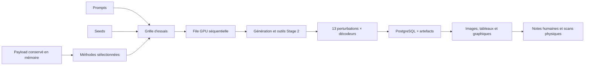

# Laboratoire Web Prooftag QR

## Objectif

Le laboratoire Web remplace les notebooks pour les campagnes comparatives courantes. Il permet
de modifier les paramètres, activer ou retirer une méthode, lancer une grille de tests,
comparer les images et mesures, puis ajouter une évaluation humaine et des scans physiques.

Il ne prétend pas trouver automatiquement une « recette magique ». Son rôle est de produire
des essais comparables et persistants afin de déterminer quelles recettes généralisent à
plusieurs prompts, seeds, payloads et conditions de lecture.



Chaque combinaison `méthode × prompt × seed` devient un essai indépendant. Les essais sont
exécutés un par un : deux pipelines lourds ne se retrouvent donc pas simultanément en VRAM.

## Ouvrir le laboratoire depuis le PC Windows

Une fois l'API déployée sur le serveur :

```powershell
cd "C:\Users\p.berdier\Documents\Paul Berdier\codage\Prooftag_QRcodePersonnalisation"
.\scripts\lab-remote.ps1
```

Le script :

1. ouvre une fenêtre SSH pour saisir le mot de passe de `paul@pcIA` ;
2. lance le `port-forward` Kubernetes sur le serveur ;
3. crée le tunnel SSH vers le PC ;
4. attend `/healthz` ;
5. ouvre `http://127.0.0.1:18080/lab`.

Pour fermer le tunnel :

```powershell
.\scripts\lab-remote.ps1 -Stop
```

En cas de conflit de port :

```powershell
.\scripts\lab-remote.ps1 -LocalPort 18081
```

Cette commande ne démarre pas le Deployment Kubernetes et ne met pas vLLM en pause. Ces
actions restent explicites afin d'éviter de prendre le GPU à une autre charge sans contrôle.

## Déployer la version contenant le laboratoire

Sur le serveur Linux :

```bash
cd ~/apps/Prooftag_QRcodePersonnalisation
git pull
docker build -t prooftag-qr:dev .
kubectl apply -k deploy/k8s
kubectl rollout status deployment/prooftag-qr -n qr-core --timeout=1200s
curl -sS http://127.0.0.1:18080/healthz
```

La dernière commande suppose qu'un ancien `port-forward` écoute déjà sur `18080`. Sinon,
utiliser le script Windows ci-dessus ou lancer temporairement :

```bash
kubectl port-forward -n qr-core service/prooftag-qr-svc 18080:8080
```

L'initContainer Alembic applique automatiquement la migration `0002_lab_schema.py` avant le
démarrage de l'API.

## Profils de départ

| Profil | État initial | Contenu réel |
|---|---:|---|
| `qr_reference` | activé | QR binaire témoin, aucune diffusion |
| `controlnet_raw` | activé | première diffusion ControlNet, sans Stage 2 |
| `srpg_paper` | activé | boucle SRPG Prooftag, SRL `500` + LPIPS `3`, sans fusion FreeQR |
| `srpg_freeqr` | désactivé | même boucle avec fusion latente FreeQR inspirée, canal et fenêtre configurables |
| `srpg_preservation` | désactivé | hypothèse anti-flou à bruit et amplitude de changement réduits |

Point de vocabulaire essentiel : `srpg_paper` reprend les poids de loss publiés et utilise la
boucle SRPG intégrée à la pipeline de production Prooftag. Ce n'est pas l'exécutable upstream
DiffQRCoder chargé depuis le checkpoint Cetus. Les résultats ne doivent donc pas être présentés
comme une reproduction bit-à-bit du dépôt officiel.

Le JSON « modèle » est prérempli avec les identifiants réellement résolus par le serveur
(`base_model_id`, `controlnet_model_id`, sous-dossier, profil de conditionnement et mode de
pipeline). Ces valeurs sont persistées dans chaque essai : un changement de ConfigMap ne peut
donc pas rendre une ancienne campagne ambiguë.

`srpg_freeqr` est une ablation inspirée de FreeQR : le blueprint QR est encodé dans le latent,
bruité au timestep courant, puis un canal sélectionné est fusionné pendant une fenêtre de
diffusion. Cette combinaison n'est pas une méthode publiée par DiffQRCoder.

## Paramètres modifiables

L'interface expose directement :

- nombre de pas, CFG, poids ControlNet et strength ;
- activation de SRPG, de la rediffusion guidée ou du raffinement latent ;
- modèle de base, ControlNet, sous-dossier et mode de pipeline ;
- paramètres détaillés des losses, seuils, transformations robustes, limites de préservation,
  seeds de Stage 2 et fusion latente.

Les deux zones JSON avancées sont validées côté API. Seules les clés explicitement autorisées
dans `prooftag_qr/lab.py` sont acceptées. SRPG et rediffusion guidée sont mutuellement exclusifs
dans une même méthode, car ce sont deux variantes concurrentes de Stage 2.

Une campagne est limitée à 500 essais. Cette limite évite une erreur de saisie qui monopoliserait
le GPU pendant plusieurs jours.

## Lecture des résultats

La page d'une campagne affiche :

- progression, nombre d'essais strictement acceptés et temps moyen ;
- tableau visuel des essais ;
- graphique SSR moyen / taux d'acceptation stricte par méthode ;
- nuage de points erreur modules / SSR robuste ;
- image finale et tous les artefacts sauvegardés ;
- temps de génération, validation et total ;
- SSR, correspondance exacte du payload, MER et toutes les métriques d'image persistées ;
- CLIPScore, similarité CLIP et CLIP-aesthetic, calculés sur CPU dans le déploiement K3s ;
- notes humaines sur 10 et favoris ;
- scans réels écran, papier ou étiquette.

Le rayon d'un point du graphique structure/lecture augmente lorsqu'une note globale est
disponible. Un résultat situé en haut à gauche a un SSR élevé et une erreur modules faible.

L'export CSV d'une campagne contient une ligne par essai avec configuration, métriques
automatiques — y compris toutes les colonnes `quality_*` — et notation humaine. Il constitue
l'entrée recommandée pour l'analyse statistique et le futur sélecteur de paramètres.

Le scoring CLIP est activé par `PROOFTAG_QR_LAB_CLIP_SCORING_ENABLED=true` dans Kubernetes.
Le modèle tourne sur CPU pour laisser les 20 Gio de VRAM à la diffusion. Son premier chargement
peut télécharger le modèle CLIP et les poids esthétiques dans le PVC `/cache`. Si ce calcul
échoue, l'essai QR reste valide : l'erreur est journalisée et comptée dans Prometheus, mais elle
ne transforme jamais une génération scannable en erreur.

## Contrat d'acceptation

`Accepté` ne signifie pas seulement « lisible une fois dans le navigateur ». Cela signifie que
la génération a franchi la porte configurée du service :

1. payload exact ;
2. ensemble des décodeurs disponibles ;
3. scénarios de dégradation simulée ;
4. seuil `PROOFTAG_QR_VALIDATION_MIN_PASS_RATE`.

En production, le seuil par défaut est `1.0`. La promesse raisonnable reste donc :

> toutes les images livrées ont franchi le protocole automatique configuré ;

et non :

> toute image générée sera lisible dans toute situation physique.

Les essais rejetés sont conservés car ils sont indispensables pour comprendre l'échec et
entraîner ultérieurement un sélecteur de paramètres.

## Ce que l'E014F a appris

E014F a montré que le Stage 2 pouvait rendre une image plus floue et beaucoup plus saturée que
le Stage 1. Sur les 24 comparaisons examinées :

- netteté moyenne : `942,10 → 535,33` ;
- saturation moyenne : `0,3616 → 0,5219` ;
- pixels fortement saturés : `0,0061 → 0,2121` ;
- pixels écrêtés : `0,0016 → 0,1088`.

La fusion FreeQR à `alpha=0,15`, canal `1`, pendant les 40 pas n'appartient pas au Stage 2
DiffQRCoder publié. Cependant, les ablations antérieures indiquent qu'elle n'explique pas seule
la saturation : le redémarrage bruité et la reconstruction Stage 2 sont la source principale,
avec une interaction dépendante du prompt.

Le laboratoire rend désormais cette causalité testable sans changer de notebook :

1. dupliquer `srpg_paper` ;
2. ne modifier qu'un paramètre ou un outil ;
3. conserver les mêmes prompts et seeds ;
4. comparer les graphiques et les artefacts ;
5. noter l'image sans consulter le nom de la méthode si une évaluation en aveugle est organisée.

## Persistance et reprise

PostgreSQL conserve les campagnes, essais, configurations et notes. Les images restent dans
le stockage d'artefacts configuré. Le payload en clair :

- n'est pas inscrit dans la base ;
- n'est pas écrit dans les logs du laboratoire ;
- est remplacé par son SHA-256 dans l'historique ;
- reste seulement en mémoire pendant la campagne.

Conséquence volontaire : après un redémarrage de l'API, une campagne en cours est marquée
`interrupted`. Elle ne peut pas reprendre automatiquement puisqu'il serait impossible de
reconstruire le QR sans conserver le payload en clair. Il faut la relancer depuis l'interface.

## Métriques Prometheus du laboratoire

| Série | Signification |
|---|---|
| `prooftag_qr_lab_campaigns_total{status}` | campagnes terminées, arrêtées ou en erreur |
| `prooftag_qr_lab_campaigns_active` | campagne actuellement exécutée |
| `prooftag_qr_lab_trials_total{method,status}` | résultats par méthode |
| `prooftag_qr_lab_trial_duration_seconds{method}` | durée de bout en bout d'un essai |
| `prooftag_qr_lab_ratings_total` | évaluations humaines enregistrées |
| `prooftag_qr_lab_quality_scores_total{status}` | scoring CLIP/esthétique réussi ou en erreur |
| `prooftag_qr_lab_quality_score_duration_seconds` | durée CPU du scoring |

Ces séries complètent les métriques de génération, validation, SRPG, rediffusion, réparation,
modèles et GPU déjà documentées dans `docs/metrics.md`.

## Procédure recommandée

Pour éviter de recommencer une campagne inutilisable :

1. lancer un smoke test avec `qr_reference`, un prompt et une seed ;
2. lancer ensuite trois méthodes, quatre prompts et deux seeds ;
3. vérifier les erreurs et la VRAM avant d'élargir ;
4. noter les images et réaliser quelques scans physiques ;
5. dupliquer uniquement les profils prometteurs ;
6. ne faire varier qu'une famille de paramètres par campagne causale ;
7. exporter le CSV et inscrire la décision dans `docs/experiment-log.md`.

Une campagne « large » ne remplace pas une campagne bien appariée. Les mêmes latents, prompts,
seeds, payloads et scénarios sont nécessaires pour attribuer correctement une amélioration à
un paramètre.
