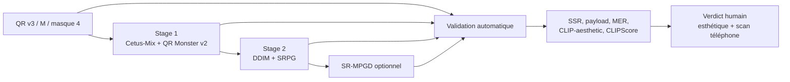

# Laboratoire Web DiffQRCoder

## Périmètre de la reprise

Depuis le 29 juillet 2026, le laboratoire ne compare plus les anciennes
réparations Prooftag, FreeQR, Nacholmo ou les rediffusions locales. Une campagne
contient uniquement :

1. le QR binaire témoin ;
2. le Stage 1 public de DiffQRCoder ;
3. le Stage 2 public avec SRPG ;
4. facultativement, le Stage 2 suivi du SR-MPGD public.

Le socle est figé au commit DiffQRCoder
`e24ea73ee2e13c7e6e87cb422e8b11784e70ae00`, avec Cetus-Mix Whalefall et
`monster-labs/control_v1p_sd15_qrcode_monster`, sous-dossier `v2`.



## Ce qui vient directement du dépôt public

- classe `DiffQRCoderPipeline` chargée depuis le dépôt épinglé ;
- scheduler DDIM ;
- Stage 1 ControlNet text-to-image ;
- Stage 2 avec `ScanningRobustLoss` et perte perceptuelle VGG ;
- QR Monster v2 et Cetus-Mix Whalefall ;
- SRG, PG, ControlNet, CFG, pas et ETA configurables ;
- SR-MPGD interne, avec itérations et learning rate configurables ;
- QR v3, masque 4, modules de 20 px et source 740×740 ;
- prétraitement en 736×736 et crop de 78 px, laissant un cœur de
  580×580, soit 29×29 modules de 20 px.

Le laboratoire ne recouvre jamais une sortie artistique avec le QR binaire.
Une image non scannable reste rejetée et visible.

## Corrections de compatibilité documentées

Le dépôt public contient deux défauts qui empêchent des réglages d’agir comme
annoncé :

- `PerceptualLoss.forward` reconstruit un tenseur avec `torch.tensor([...])`,
  ce qui détache les pertes VGG du graphe. Le wrapper emploie `torch.stack`,
  sans changer la formule ;
- `DiffQRCoderPipeline.__call__` ne transmet pas `srmpgd_lr` à `_run_stage2`.
  Le wrapper appelle `_run_stage2` explicitement et transmet la valeur choisie.

Ces corrections sont déclarées dans `/v1/lab/schema`. Le commit amont n’est
pas modifié sur disque.

## Limite par rapport au papier

Le papier décrit une transformation QArt Reed–Solomon entre les deux stages et
un redémarrage depuis le Stage 1 bruité. Le dépôt public ne fournit pas le
générateur QArt complet et sa méthode `_run_stage2` initialise un nouveau bruit.
Ce Web Lab reproduit donc le chemin **exécutable public**, pas une reconstruction
supposée des éléments absents.

Pour comparer des paramètres, le Stage 2 reçoit une seed dérivée explicite
(`seed + srpg_seed_offset`). Les recettes d’un même prompt et d’une même seed
peuvent ainsi partager le même bruit Stage 2.

## Utilisation

Depuis Windows :

```powershell
cd "C:\Users\p.berdier\Documents\Paul Berdier\codage\Prooftag_QRcodePersonnalisation"
.\scripts\lab-remote.ps1
```

L’interface s’ouvre sur `http://127.0.0.1:18080/lab`.

Pour créer une campagne :

1. saisir une URL Prooftag courte compatible avec QR v3 ;
2. ajouter une ligne par prompt au format
   `identifiant | prompt | negative prompt` ;
3. ajouter une ou plusieurs seeds séparées par des virgules ;
4. activer les sorties à comparer ;
5. dupliquer une recette pour tester d’autres paramètres ;
6. lancer la campagne.

Chaque combinaison `prompt × seed × recette` devient un résultat indépendant.
La limite est de 500 résultats. Les générations sont séquentielles pour ne pas
charger plusieurs pipelines en VRAM.

### Paramètres exposés

- Stage 1 : pas, CFG, poids ControlNet ;
- Stage 2 : pas, poids ControlNet, SRG `λ1`, PG `λ2`, ETA, seed offset ;
- artefacts : fréquence des aperçus intermédiaires ;
- SR-MPGD : itérations et learning rate ;
- avancé : modèles, commit et géométrie QR.

Les valeurs initiales sont 40 pas, CFG 7,5, ControlNet 1,35, SRG 500, PG 2
et ETA 0. SR-MPGD démarre à 20 itérations et LR 0,1. Ce sont des points de
départ, pas une garantie de lecture.

## Scores automatiques par image

Chaque image finale est testée avec les décodeurs installés et les scénarios de
dégradation du projet. L’interface affiche :

- **SSR robuste** : proportion de validations relisant le payload exact ;
- **Payload original** : réussite sans dégradation ;
- **MER** : taux de modules incorrects ;
- **CLIP-aesthetic**, **CLIPScore** et similarité CLIP ;
- temps de génération, validation et total ;
- tableau `décodeur × scénario × résultat × latence`.

Une sortie est `accepted` seulement si tous les décodeurs originaux relisent le
payload exact et si le SSR atteint le seuil configuré, actuellement 100 %.

## Validation humaine à la chaîne

Cliquer une vignette, puis enregistrer :

- esthétique bonne ou mauvaise ;
- scannable, non scannable ou non testé sur téléphone ;
- note esthétique de 1 à 10 ;
- notes libres.

Le bouton **Enregistrer et suivant** ouvre immédiatement l’image suivante. La
campagne agrège le taux automatique strict, SSR, CLIP-aesthetic, CLIPScore,
scans humains positifs, esthétiques positives et nombre d’images évaluées.
L’export CSV contient les paramètres, métriques et verdicts humains.

## Déploiement sans ambiguïté de version

Après commit et push, sur le serveur :

```bash
cd ~/apps/Prooftag_QRcodePersonnalisation
git pull --ff-only origin main
bash scripts/deploy-app-image.sh
```

Le script refuse un dépôt sale, construit une image taguée avec le commit Git,
vérifie le commit DiffQRCoder, importe l’image dans containerd K3s, applique la
migration `0004_human_verdicts`, attend le rollout puis contrôle dans le pod les
quatre profils, l’import DiffQRCoder et la version
`20260729-diffqrcoder-1` des assets Web.

Le taux publiable sera calculé sur les sorties artistiques réellement générées,
jamais sur le QR témoin ni sur une réparation cachée.
