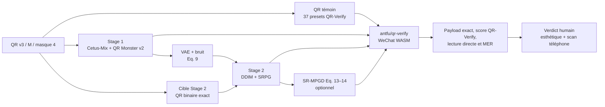

# Laboratoire Web DiffQRCoder

## Périmètre de la reprise

Depuis le 29 juillet 2026, le laboratoire ne compare plus les anciennes
réparations Prooftag, FreeQR, Nacholmo ou les rediffusions locales. Une campagne
contient uniquement :

1. le QR binaire témoin ;
2. le Stage 1 public de DiffQRCoder ;
3. le Stage 2 SRPG binaire initialisé selon l’équation 9 du papier ;
4. la sélection automatique du meilleur Stage 1 / Stage 2 ;
5. facultativement, le Stage 2 suivi du SR-MPGD des équations 13–14 ;
6. des ablations désactivées par défaut (force de bruit et QArt public).

Le socle est figé au commit DiffQRCoder
`e24ea73ee2e13c7e6e87cb422e8b11784e70ae00`, avec Cetus-Mix Whalefall et
`monster-labs/control_v1p_sd15_qrcode_monster`, sous-dossier `v2`.



## Ce qui vient directement du dépôt public

- classe `DiffQRCoderPipeline` chargée depuis le dépôt épinglé ;
- scheduler DDIM ;
- Stage 1 ControlNet text-to-image ;
- Stage 2 avec `ScanningRobustLoss` et perte perceptuelle VGG ;
- QR Monster v2 et Cetus-Mix Whalefall ;
- SRG, PG, ControlNet, CFG, pas et ETA configurables ;
- QR v3, masque 4, modules de 20 px et source 740×740 ;
- prétraitement en 736×736 et crop de 78 px, laissant un cœur de
  580×580, soit 29×29 modules de 20 px.

Le laboratoire ne recouvre jamais une sortie artistique avec le QR binaire.
Une image non scannable reste rejetée et visible.

## Reconstruction conforme à l’algorithme du papier

Le dépôt public ne reproduit pas seul tout l’algorithme décrit dans le papier :

- `PerceptualLoss.forward` reconstruit un tenseur avec `torch.tensor([...])`,
  ce qui détache les pertes VGG du graphe. Le wrapper emploie `torch.stack`,
  sans changer la formule ;
- `_run_stage2` génère normalement un nouveau bruit aléatoire. Le wrapper encode
  réellement l’image du Stage 1 avec le VAE puis lui ajoute le bruit DDIM au
  timestep de départ, conformément à l’équation 9 ;
- le constructeur Reed–Solomon de la cible `Qart(x̂, y)` n’est pas publié. Le
  wrapper utilise donc le QR binaire exact comme cible de repli : il est moins
  proche du Stage 1, mais son payload et sa matrice sont garantis ;
- le SR-MPGD public réutilise la loss pondérée du Stage 2. Le wrapper applique
  séparément l’équation 13, `LSR + 0,01 × LPIPS`, puis l’équation 14 avec
  `gamma=1000`.

SR-MPGD décode et valide chaque état, s’arrête en cas de succès strict ou de
gradient non fini et livre le meilleur état observé — jamais aveuglément la
dernière itération. Ces corrections sont déclarées dans `/v1/lab/schema`. Le
commit amont n’est pas modifié sur disque.

## Limite honnête de la cible QArt

Le papier transforme le QR avec QArt afin de rapprocher son motif de l’image
Stage 1. Le dépôt officiel consomme cette image, mais ne contient pas le
constructeur. Une ancienne version Prooftag avait fabriqué un hybride coloré
en remplaçant des centres de modules : ce n’était pas QArt et ce raster était
ensuite binarisé par la loss SRL comme s’il s’agissait d’un QR valide.

Cette imitation est supprimée. Le laboratoire passe désormais le QR binaire
exact à ControlNet et à SRL. Un vrai QArt ne pourra revenir que dans un mode
expérimental séparé, avec preuve de décodage du payload Prooftag avant toute
diffusion.

Pour comparer des paramètres, le Stage 2 reçoit une seed dérivée explicite
(`seed + srpg_seed_offset`). Les recettes d’un même prompt et d’une même seed
peuvent ainsi partager le même bruit Stage 2.

## Utilisation

Depuis Windows :

```powershell
cd "C:\Users\p.berdier\Documents\Paul Berdier\codage\Prooftag_QRcodePersonnalisation"
.\scripts\lab-remote.ps1
```

L’interface s’ouvre sur `http://127.0.0.1:18080/lab`.

Pour créer une campagne :

1. saisir une URL Prooftag courte compatible avec QR v3 ;
2. ajouter une ligne par prompt au format
   `identifiant | prompt | negative prompt` ;
3. ajouter une ou plusieurs seeds séparées par des virgules ;
4. activer les sorties à comparer ;
5. dupliquer une recette pour tester d’autres paramètres ;
6. lancer la campagne.

Chaque combinaison `prompt × seed × recette` devient un résultat indépendant.
La limite est de 500 résultats. Les générations sont séquentielles pour ne pas
charger plusieurs pipelines en VRAM.

### Paramètres exposés

- Stage 1 : pas, CFG, poids ControlNet ;
- Stage 2 : initialisation papier ou bruit public, quantité de bruit, pas,
  poids ControlNet, SRG `λ1`, PG `λ2`, ETA et seed offset ;
- cible Stage 2 : QR binaire exact, non modifiable dans le profil de production ;
- artefacts : fréquence des aperçus intermédiaires ;
- SR-MPGD : itérations, `gamma`, poids LPIPS et MER initial maximal ;
- avancé : modèles, commit et géométrie QR.

Les valeurs initiales sont 40 pas, CFG 7,5, ControlNet 1,35, SRG 500, PG 2
et ETA 0. Le profil SR-MPGD sécurisé démarre à 4 itérations, `gamma=100` et
`LPIPS=0,10`. Les valeurs du papier (`gamma=1000`, `LPIPS=0,01`) restent des
paramètres expérimentaux, pas une garantie de lecture.

## Validation automatique par image

Depuis E024, chaque image finale est testée uniquement avec
`antfu/qr-verify@0.2.0`. L’interface affiche :

- **QR-Verify valide** : au moins un preset restitue le payload attendu ;
- **score QR-Verify** : proportion des 37 presets exacts, normalisée par ceux
  que le QR témoin sait passer ;
- **lecture sans filtre** : résultat du preset original ;
- **presets exacts** : numérateur et dénominateur du score ;
- **MER** : taux de modules incorrects, conservé comme diagnostic ;
- temps de génération, validation et total ;
- initialisation réellement employée, pas effectifs et erreur des centres QArt ;
- variation par rapport au Stage 1 et détection de divergence/saturation ;
- paramètres SR-MPGD réellement appliqués et itération retenue ;
- tableau `preset × paramètres × résultat exact × latence`.

Le scanner est `qr-scanner-wechat@0.1.3` en WebAssembly. Le pont Prooftag garde
la réduction à 300 px et les 37 prétraitements amont, les rend déterministes et
vérifie le payload exact au lieu d'accepter n'importe quel texte décodé.

Le MER Stage 2/SR-MPGD est mesuré sur la géométrie réellement optimisée par
DiffQRCoder : crop 78 px, cœur 580×580 et modules entiers de 20 px. Il n'est
plus calculé en découpant naïvement le canvas 736 px en 37 cellules.

Une sortie est `accepted` si au moins un preset QR-Verify restitue le payload et
si la garde de divergence du générateur est respectée. Le score QR-Verify classe
la tolérance logicielle, mais n'est pas une probabilité de scan téléphone.

### Recette par défaut après la campagne fc403349

- cible Stage 2 : QR binaire exact ;
- force de bruit : `0,65`, pour préserver davantage le Stage 1 que la force
  `1,0`, qui démarrait presque dans du bruit pur ;
- sélection automatique : mode de livraison optionnel qui conserve d'abord une
  sortie acceptée, puis la moins altérée. Il est désactivé dans les campagnes
  visuelles pour ne pas afficher une copie supplémentaire de la sortie retenue ;
- SR-MPGD : activé dans E018, lancé seulement si le MER Stage 2 est au plus
  `12 %` et uniquement sur le latent SHA-256 exact du SRPG correspondant ;
- QArt public : expérimental et désactivé, car les quatre sorties testées ont
  échoué au téléphone malgré une cible valide avant diffusion ;
- ablation de force disponible : `0,35 / 0,50 / 0,65 / 0,80`.

## Validation humaine à la chaîne

Cliquer une vignette, puis enregistrer :

- esthétique bonne ou mauvaise ;
- scannable, non scannable ou non testé sur téléphone ;
- note esthétique de 1 à 10 ;
- notes libres.

Le bouton **Enregistrer et suivant** ouvre immédiatement l’image suivante. La
campagne agrège les validations QR-Verify, leur score moyen, les lectures sans
filtre, les scans humains, les esthétiques positives et les images évaluées.
L’export CSV contient les paramètres, métriques et verdicts humains.

## Déploiement sans ambiguïté de version

Après commit et push, sur le serveur :

```bash
cd ~/apps/Prooftag_QRcodePersonnalisation
git pull --ff-only origin main
bash scripts/deploy-app-image.sh
```

Le script refuse un dépôt sale, construit une image taguée avec le commit Git,
vérifie le commit DiffQRCoder, importe l’image dans containerd K3s, applique la
migration `0005_e017_phone_calibration`, attend le rollout puis contrôle dans le pod les
profils de production et d'ablation, l’import DiffQRCoder, la version
`20260805-e024-qr-verify-3` des assets Web et un vrai décodage WASM 37/37 du QR
témoin.

Le taux publiable sera calculé sur les sorties artistiques réellement générées,
jamais sur le QR témoin ni sur une réparation cachée.

La phase E017 est décrite dans
[`e017-phone-proxy-calibration.md`](e017-phone-proxy-calibration.md). Le score
Phone Proxy affiché dans les cartes est une métrique de calibration et non une
porte d'acceptation. Les évaluations téléphone doivent maintenant enregistrer
les essais, les réussites et l'appareil pour rendre la comparaison statistique
exploitable.

La phase E018 est décrite dans
[`e018-strict-stage2-pairing.md`](e018-strict-stage2-pairing.md). Dans le détail
d'un résultat SR-MPGD, vérifier **Appariement Stage 2 = Exact — SHA identique**
avant de noter ou d'utiliser l'image dans une comparaison.

E019 ajoute les bornes de pas latent, déplacement total, LPIPS, changement
d'image, saturation et écrêtage directement dans chaque carte SR-MPGD. Le
protocole et la matrice factorielle sont décrits dans
[`e019-safe-srmpgd.md`](e019-safe-srmpgd.md).

E020 ajoute le profil apparié `diffqrcoder_srmpgd_robust` et une table de
trajectoire par itération. La méthode et le protocole sont documentés dans
[`e020-srmpgd-trace-robust-loss.md`](e020-srmpgd-trace-robust-loss.md).
