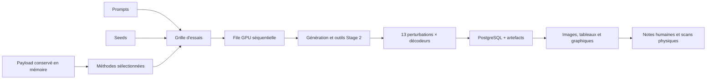

# Laboratoire Web Prooftag QR

## Objectif

Le laboratoire Web remplace les notebooks pour les campagnes comparatives courantes. Il permet
de modifier les paramètres, activer ou retirer une méthode, lancer une grille de tests,
comparer les images et mesures, puis ajouter une évaluation humaine et des scans physiques.

Il ne prétend pas trouver automatiquement une « recette magique ». Son rôle est de produire
des essais comparables et persistants afin de déterminer quelles recettes généralisent à
plusieurs prompts, seeds, payloads et conditions de lecture.



Chaque combinaison `méthode × prompt × seed` devient un essai indépendant. Les essais sont
exécutés un par un : deux pipelines lourds ne se retrouvent donc pas simultanément en VRAM.

Depuis la correction « candidat forcé », le laboratoire sépare strictement deux usages :

- **recherche** : la sortie demandée (`raw`, `srpg`, `srmpgd`, `guided` ou `latent`) est évaluée telle
  quelle, même si elle échoue à la lecture ;
- **livraison** : la sélection automatique et les réparations déterministes restent disponibles
  avec la sortie `auto`, mais ne sont pas utilisées par les profils comparatifs fournis.

Une réparation QR binaire ne peut donc plus remplacer silencieusement le candidat artistique
d'une méthode de recherche.

## Ouvrir le laboratoire depuis le PC Windows

Une fois l'API déployée sur le serveur :

```powershell
cd "C:\Users\p.berdier\Documents\Paul Berdier\codage\Prooftag_QRcodePersonnalisation"
.\scripts\lab-remote.ps1
```

Le script :

1. ouvre une fenêtre SSH pour saisir le mot de passe de `paul@pcIA` ;
2. lance le `port-forward` Kubernetes sur le serveur ;
3. crée le tunnel SSH vers le PC ;
4. attend `/healthz` ;
5. ouvre `http://127.0.0.1:18080/lab`.

Pour fermer le tunnel :

```powershell
.\scripts\lab-remote.ps1 -Stop
```

En cas de conflit de port :

```powershell
.\scripts\lab-remote.ps1 -LocalPort 18081
```

Cette commande ne démarre pas le Deployment Kubernetes et ne met pas vLLM en pause. Ces
actions restent explicites afin d'éviter de prendre le GPU à une autre charge sans contrôle.

## Déployer la version contenant le laboratoire

Sur le serveur Linux :

```bash
cd ~/apps/Prooftag_QRcodePersonnalisation
git pull
bash scripts/deploy-app-image.sh
```

Le script refuse un dépôt sale, construit une image portant les douze premiers caractères du
commit Git, l'importe dans le containerd de K3s, met à jour le conteneur API et l'initContainer
de migration, attend le rollout et vérifie le profil `srpg_late_2` jusque dans le pod. Il évite le
problème récurrent d'un tag `dev` inchangé que Kubernetes ne redéploie pas.

Pour contrôler ensuite l'API, utiliser le script Windows ci-dessus ou lancer temporairement :

```bash
kubectl port-forward -n qr-core service/prooftag-qr-svc 18080:8080
```

L'initContainer Alembic applique automatiquement la migration `0002_lab_schema.py` avant le
démarrage de l'API.

## Profils de départ

| Profil | État initial | Contenu réel |
|---|---:|---|
| `qr_reference` | activé | QR binaire témoin, aucune diffusion |
| `controlnet_raw` | activé | première diffusion ControlNet, sans Stage 2 |
| `srpg_late_2` | activé | témoin SRPG sur les 2 derniers pas, marge claire adaptée, aucun renforcement |
| `srpg_late_2_functional` | activé | même Stage 2 et même latent, puis tonification des seuls motifs fonctionnels |
| `srpg_late_2_functional_srmpgd` | activé | même présentation fonctionnelle, puis SR-MPGD si le MER initial est admissible |
| `srpg_late_4` | désactivé | ancienne ablation sur les 4 derniers pas DDIM |
| `srpg_late_4_srmpgd` | désactivé | ancienne ablation tardive conservée uniquement pour audit |
| `srpg_full_restart` | désactivé | ablation publique : redémarrage complet destructif, 40 pas SRPG |
| `srpg_full_restart_srmpgd` | désactivé | même Stage 2 complet, puis SR-MPGD si le MER initial est au plus 10 % |
| `srpg_freeqr` | désactivé | même boucle avec fusion latente FreeQR inspirée, canal et fenêtre configurables |

Tous les profils génératifs fournis figent explicitement le socle DiffQRCoder :

- Cetus-Mix Whalefall fp16 comme modèle Stable Diffusion 1.5 ;
- QR Code Monster v2 comme ControlNet, sous-dossier `v2` ;
- pipeline `img2img` ; les profils tardifs historiques utilisent `gray_quiet_zone`, tandis que
  les deux profils publics complets utilisent la condition binaire transmise par le dépôt officiel.

Le chargeur accepte désormais le checkpoint Cetus au format Safetensors « single file » ; il ne
retombe donc pas silencieusement sur le modèle SD 1.5 + Dion de la ConfigMap. Ces identifiants
sont visibles dans le JSON « modèle » et persistés dans chaque essai.

Les profils fournis sélectionnent explicitement leur sortie :

- `qr_reference` et `controlnet_raw` évaluent `raw` ;
- tous les profils SRPG évaluent le candidat `srpg` lui-même ;
- `srpg_full_restart_srmpgd` évalue le meilleur état `srmpgd`, jamais l'ancien raffinement latent ;
- `auto` est réservé à une simulation de la chaîne de livraison avec réparation éventuelle.

Quand deux méthodes ont exactement le même modèle, prompt, seed, géométrie et paramètres de
Stage 1, l'image brute est générée une seule fois puis conservée en RAM CPU. Les méthodes
suivantes reçoivent cette même image comme entrée. La fiche d'un essai affiche
`Stage 1 réutilisé — aucune régénération` et conserve l'identifiant du run source.

Point de vocabulaire essentiel : `SR-MPGD papier` désigne uniquement le post-traitement des
équations 12-14. Il part du tenseur latent propre exact produit par le Stage 2, minimise
`LSR + 0,01 × LPIPS` avec `gamma=1000`, gèle tous les poids et ne réencode jamais le PNG.
La SRL suit maintenant exactement la normalisation `1/N` de l'équation 6 et les pertes excluent
automatiquement la quiet zone, comme les appels `crop_padding` du code officiel. Le profil public
effectue les 40 pas du Stage 2. Le transformateur QArt Reed-Solomon de la Figure 3 n'est toutefois
pas publié ; la condition reste donc le QR binaire valide et la chaîne n'est pas présentée comme
une reproduction bit-à-bit de tout l'article.

SR-MPGD est une finition locale. Si le Stage 2 dépasse 10 % de modules incorrects, aucune descente
à `gamma=1000` n'est lancée : l'état 0 est conservé avec le motif
`initial_module_error_rate_above_limit`. Cela empêche de transformer SR-MPGD en reconstructeur QR
agressif, cas qui produisait les textures bleues et la forte chute du CLIP-aesthetic.

La quiet zone est exclue de SRL et de LPIPS comme dans le chemin DiffQRCoder, mais elle ne peut
pas rester texturée dans l'image livrée. Après chaque décodage final SRPG/SR-MPGD, le laboratoire
remplace uniquement les quatre modules périphériques par une couleur uniforme claire dérivée de
la palette de l'image. Le mode `white` conserve le blanc strict ; le mode `none` est réservé à
l'exploration esthétique et ne doit pas être livré sans marge externe sur le support. Le cœur
artistique n'est ni projeté ni recouvert. Les métriques distinguent désormais
`*_core_module_error_rate`, `*_quiet_zone_module_error_rate`, le MER des motifs fonctionnels,
le MER des données et le MER réellement livré.

Le profil `srpg_late_2_functional` ajoute une opération distincte : finders, séparateurs,
timings, format et alignements sont rapprochés de leur ton noir/blanc en conservant leur teinte
et leur texture. Aucun module de données n'est modifié. Cette hypothèse reprend le constat de
Face2QR selon lequel le renforcement explicite des motifs de détection doit précéder le
raffinement latent ; ce n'est ni une projection du QR complet ni une preuve de généralisation.

L'ancien interrupteur `raffinement latent` reste disponible pour reproduire les expériences
historiques, mais il est désormais nommé comme tel. Il réencode le PNG, emploie une loss
multiscale et une trust region Prooftag : ce n'est pas SR-MPGD.

`srpg_full_restart` conserve volontairement l'ancien redémarrage complet pour une ablation. À
`srpg_steps=40` et `srpg_strength=1,0`, Diffusers exécute réellement 40 pas et le Stage 1 est
presque entièrement rebruité. Les essais du 29 juillet 2026 montrent que cette configuration peut
produire flou, saturation et perte du prompt. La limite `srpg_max_mean_absolute_change` est une
porte de rejet appliquée après génération ; elle n'empêche pas la dégradation pendant la boucle.

Les profils actifs emploient le même calendrier de 40 pas mais n'en sélectionnent que la fin :

- `0,05 × 40 = 2` pas effectifs pour le profil équilibré ;
- `0,10 × 40 = 4` pas effectifs pour le profil plus robuste.

Ce choix est une hypothèse Prooftag issue d'E014E, pas un résultat déjà généralisé. E014E avait
observé 148/156 validations pour deux pas et 153/156 pour quatre pas avec son mécanisme de fusion
masquée. Le laboratoire doit maintenant vérifier si cette fenêtre tardive reste bénéfique avec la
loss SRPG, sur les mêmes Stage 1, prompts et seeds.

Le JSON « modèle » contient les identifiants réellement choisis par le profil
(`base_model_id`, `controlnet_model_id`, sous-dossier, profil de conditionnement et mode de
pipeline). Ces valeurs sont persistées dans chaque essai : un changement de ConfigMap ne peut
donc pas rendre une ancienne campagne ambiguë.

`srpg_freeqr` est une ablation inspirée de FreeQR : le blueprint QR est encodé dans le latent,
bruité au timestep courant, puis un canal sélectionné est fusionné pendant une fenêtre de
diffusion. Cette combinaison n'est pas une méthode publiée par DiffQRCoder.

## Paramètres modifiables

L'interface expose directement :

- pas, CFG, poids ControlNet et strength du Stage 1, nommés explicitement comme tels ;
- pas planifiés, force de redémarrage, poids ControlNet, poids QR, poids perceptuel, poids
  fonctionnel et limite de gradient RMS du Stage 2 SRPG ;
- nombre de pas SRPG réellement exécutés, recalculé instantanément avec
  `floor(srpg_steps × srpg_strength)` ;
- activation de SRPG, de la rediffusion guidée ou du raffinement latent ;
- activation indépendante du post-traitement SR-MPGD, avec nombre maximal d'itérations,
  `gamma` et poids LPIPS ;
- mode et luminance minimale de la quiet zone, ainsi que la tonification ciblée des motifs
  fonctionnels (`0` désactive ; `0,12` constitue le profil fort proposé) ;
- modèle de base, ControlNet, sous-dossier et mode de pipeline ;
- paramètres détaillés des losses, seuils, transformations robustes, limites de préservation,
  seeds de Stage 2 et fusion latente.

Les deux zones JSON avancées sont validées côté API. Seules les clés explicitement autorisées
dans `prooftag_qr/lab.py` sont acceptées. SRPG et rediffusion guidée sont mutuellement exclusifs
dans une même méthode, car ce sont deux variantes concurrentes de Stage 2.

SR-MPGD exige SRPG, car son entrée est le latent propre exact du Stage 2. Chaque état, y compris
l'état zéro, est décodé et soumis à la matrice complète de décodeurs et perturbations. La sélection
priorise validation stricte, SSR, pire décodeur, pire scénario, MER/SRL, puis LPIPS. Le premier
état strict arrête la boucle ; sinon le meilleur état observé est conservé comme résultat de
recherche, même rejeté.

Le champ « Stage 1 — pas de diffusion » ne pilote jamais SRPG. Pour demander 40 pas SRPG
réellement exécutés, il faut choisir `SRPG — pas planifiés = 40` et
`SRPG — force de redémarrage = 1,00`. Avec `40` et `0,10`, la boucle exécute volontairement
quatre pas tardifs. Une combinaison donnant moins d'un pas est rejetée avant de monopoliser le
GPU. La fiche résultat persiste les valeurs SRPG effectivement résolues afin de prouver ce qui a
été transmis au backend.

Une campagne est limitée à 500 essais. Cette limite évite une erreur de saisie qui monopoliserait
le GPU pendant plusieurs jours.

## Lecture des résultats

La page d'une campagne affiche :

- progression, nombre d'essais strictement acceptés et temps moyen ;
- tableau visuel des essais ;
- graphique SSR moyen / taux d'acceptation stricte par méthode ;
- nuage de points erreur modules / SSR robuste ;
- image finale et tous les artefacts sauvegardés ;
- une image `srmpgd_iteration_XX` pour chaque état évalué par SR-MPGD ;
- temps de génération, validation et total ;
- SSR, correspondance exacte du payload, MER et toutes les métriques d'image persistées ;
- CLIPScore, similarité CLIP et CLIP-aesthetic, calculés sur CPU dans le déploiement K3s ;
- notes humaines sur 10 et favoris ;
- scans réels écran, papier ou étiquette.

La première image d'une fiche est toujours `RÉSULTAT ÉVALUÉ` et indique la variante exacte.
`STAGE 1 PARTAGÉ` apparaît ensuite uniquement lorsqu'il est visuellement différent. Les fichiers
strictement identiques au résultat final sont dédupliqués dans la galerie.

Le QR témoin est affiché comme contrôle de décodeurs, mais il est exclu des graphiques de
classement artistique et du scoring CLIP. Son SSR parfait ne constitue jamais une victoire sur
une méthode générative.

Le rayon d'un point du graphique structure/lecture augmente lorsqu'une note globale est
disponible. Un résultat situé en haut à gauche a un SSR élevé et une erreur modules faible.

L'export CSV d'une campagne contient une ligne par essai avec configuration, métriques
automatiques — y compris toutes les colonnes `quality_*` — et notation humaine. Il constitue
l'entrée recommandée pour l'analyse statistique et le futur sélecteur de paramètres.

Les colonnes `selected_variant`, `selection_mode`, `stage1_reused` et
`stage1_source_run_id` empêchent de confondre un candidat de diffusion avec une réparation de
livraison ou une régénération indépendante.

Le scoring CLIP est activé par `PROOFTAG_QR_LAB_CLIP_SCORING_ENABLED=true` dans Kubernetes.
Le modèle tourne sur CPU pour laisser les 20 Gio de VRAM à la diffusion. Son premier chargement
peut télécharger le modèle CLIP et les poids esthétiques dans le PVC `/cache`. Si ce calcul
échoue, l'essai QR reste valide : l'erreur est journalisée et comptée dans Prometheus, mais elle
ne transforme jamais une génération scannable en erreur.

## Contrat d'acceptation

`Accepté` ne signifie pas seulement « lisible une fois dans le navigateur ». Cela signifie que
la génération a franchi la porte configurée du service :

1. payload exact ;
2. ensemble des décodeurs disponibles ;
3. scénarios de dégradation simulée ;
4. seuil `PROOFTAG_QR_VALIDATION_MIN_PASS_RATE`.

En production, le seuil par défaut est `1.0`. La promesse raisonnable reste donc :

> toutes les images livrées ont franchi le protocole automatique configuré ;

et non :

> toute image générée sera lisible dans toute situation physique.

Les essais rejetés sont conservés car ils sont indispensables pour comprendre l'échec et
entraîner ultérieurement un sélecteur de paramètres.

## Ce que l'E014F a appris

E014F a montré que le Stage 2 pouvait rendre une image plus floue et beaucoup plus saturée que
le Stage 1. Sur les 24 comparaisons examinées :

- netteté moyenne : `942,10 → 535,33` ;
- saturation moyenne : `0,3616 → 0,5219` ;
- pixels fortement saturés : `0,0061 → 0,2121` ;
- pixels écrêtés : `0,0016 → 0,1088`.

La fusion FreeQR à `alpha=0,15`, canal `1`, pendant les 40 pas n'appartient pas au Stage 2
DiffQRCoder publié. Cependant, les ablations antérieures indiquent qu'elle n'explique pas seule
la saturation : le redémarrage bruité et la reconstruction Stage 2 sont la source principale,
avec une interaction dépendante du prompt.

Le laboratoire rend désormais cette causalité testable sans changer de notebook :

1. dupliquer `srpg_late_2` ou `srpg_late_4` ;
2. ne modifier qu'un paramètre ou un outil ;
3. conserver les mêmes prompts et seeds ;
4. comparer les graphiques et les artefacts ;
5. noter l'image sans consulter le nom de la méthode si une évaluation en aveugle est organisée.

## Persistance et reprise

PostgreSQL conserve les campagnes, essais, configurations et notes. Les images restent dans
le stockage d'artefacts configuré. Le payload en clair :

- n'est pas inscrit dans la base ;
- n'est pas écrit dans les logs du laboratoire ;
- est remplacé par son SHA-256 dans l'historique ;
- reste seulement en mémoire pendant la campagne.

Conséquence volontaire : après un redémarrage de l'API, une campagne en cours est marquée
`interrupted`. Elle ne peut pas reprendre automatiquement puisqu'il serait impossible de
reconstruire le QR sans conserver le payload en clair. Il faut la relancer depuis l'interface.

## Métriques Prometheus du laboratoire

| Série | Signification |
|---|---|
| `prooftag_qr_lab_campaigns_total{status}` | campagnes terminées, arrêtées ou en erreur |
| `prooftag_qr_lab_campaigns_active` | campagne actuellement exécutée |
| `prooftag_qr_lab_trials_total{method,status}` | résultats par méthode |
| `prooftag_qr_lab_trial_duration_seconds{method}` | durée de bout en bout d'un essai |
| `prooftag_qr_lab_ratings_total` | évaluations humaines enregistrées |
| `prooftag_qr_lab_quality_scores_total{status}` | scoring CLIP/esthétique réussi ou en erreur |
| `prooftag_qr_lab_quality_score_duration_seconds` | durée CPU du scoring |

Ces séries complètent les métriques de génération, validation, SRPG, rediffusion, réparation,
modèles et GPU déjà documentées dans `docs/metrics.md`.

## Procédure recommandée

Pour éviter de recommencer une campagne inutilisable :

1. lancer un smoke test avec `qr_reference`, un prompt et une seed ;
2. comparer `controlnet_raw`, `srpg_late_2`, `srpg_late_2_functional` et
   `srpg_late_2_functional_srmpgd` en conservant
   « Réutiliser le même Stage 1 » ;
3. vérifier que la sortie évaluée vaut respectivement `raw` et `srpg` ;
4. lancer ensuite trois méthodes, quatre prompts et deux seeds ;
5. vérifier les erreurs et la VRAM avant d'élargir ;
6. noter les images et réaliser quelques scans physiques ;
7. dupliquer uniquement les profils prometteurs ;
8. ne faire varier qu'une famille de paramètres par campagne causale ;
9. exporter le CSV et inscrire la décision dans `docs/experiment-log.md`.

Une campagne « large » ne remplace pas une campagne bien appariée. Les mêmes latents, prompts,
seeds, payloads et scénarios sont nécessaires pour attribuer correctement une amélioration à
un paramètre.
